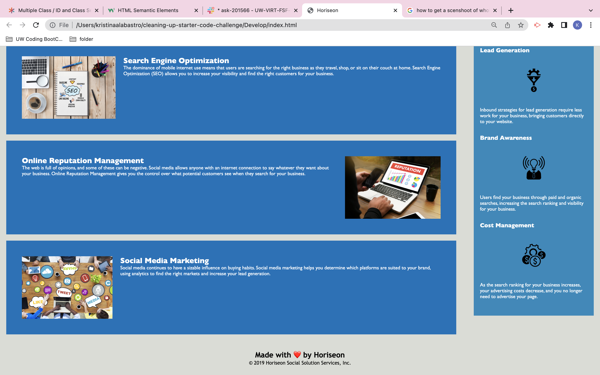

# Cleaning Up Starter Code in HTML and CSS Stylesheet Challenge

## Description

This is a challenge assignment to refactor the starter code without changing what it does, but to simply make it more accessible and functional for users. This project provided me with practical experience with the goals of efficiently cosolidating CSS selectors and properties and to identify key semantic tags found in most HTML webpages.

## Installation
N/A

## Usage
To learn more information about the marketing agency, Horiseon, use the nagivation bar on the top right-hand side of the website to filter down to the corresponding section.

## Credits
N/A
